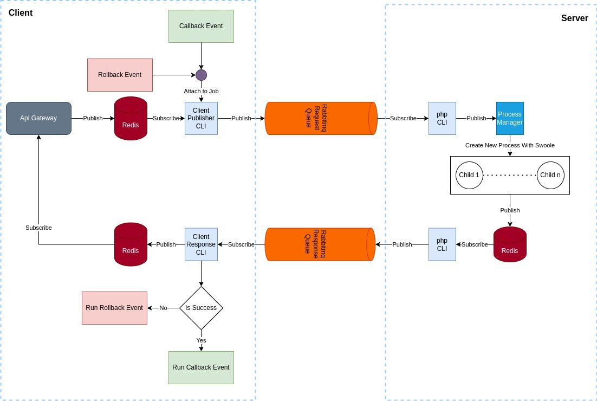

# Orchestration Saga

This package is for implementing the Saga orchestration design pattern for designing microservices. Using this pattern,
you can easily implement communication between services using `Redis` and `RabbitMQ`.

## Installation

    composer require vandarpay/orchestration-saga

### Publish Config File

    php artisan vendor:publish --provider="vandarpay\OrchestrationSaga\OrchestrationSagaServiceProvider"

## Requirement

- PHP 8.1
- RabbitMQ
- Redis
- PHP redis extension
- PHP swoole extension

## Environments

Please add this environment variable to `.env` file

    RPC_RABBITMQ_HOST=localhost
    RPC_RABBITMQ_PORT=5672
    RPC_RABBITMQ_USER=guest
    RPC_RABBITMQ_PASSWORD=guest
    RPC_RABBITMQ_CONNECTION_TIMEOUT=30
    RPC_RABBITMQ_READ_WRITE_TIMEOUT=30
    RPC_RABBITMQ_KEEP_ALIVE=true
    RPC_USE_EXCHANGE_LOG=true
    RPC_REQUEST_TIMEOUT=30
    RPC_DEBUG=false 
    RPC_DEBUG_LOG_CHANNEL=rpc 
    LOG_JOB=App/Jobs/RpcLogJob 

- #### RPC_USE_EXCHANGE_LOG :

If this feature is activated, the application will use the **rabbitmq exchange** feature when creating queues, and all
requests , responses will be duplicated in the queue with the `log` name.

- #### RPC_REQUEST_TIMEOUT :

The duration of sending a request until receiving a response from another service is set by this parameter

- #### RPC_DEBUG :

By activating this parameter, all communication steps in your service will be saved in the log file. Use this feature
only during development.
Also use the `RPC_DEBUG_LOG_CHANNEL` parameter to specify the log storage channel.
Obviously, the channel introduced in the `RPC_DEBUG_LOG_CHANNEL` parameter must be defined in the `logging.php` file.

- #### LOG_JOB :

You can use this parameter to introduce a job to store all the states that occur for a request.
The input of this job is of `RpcLogJobDto` type and the following statuses can be received in this job.

- **init** : New request received
- **sent**: The request was sent to the destination server
- **received**: The request was received
- **expired**: the desired request has expired
- **before_transform**: before transforming the data to transfer to the destination server
- **Processing**: The request is being processed
- **processed**: The request was processed
- **reply_request** : Sending reply
- **answered**: The answer was sent
- **response_received**: Response received
- **server_exception**: An error occurred in the destination service
- **client_exception**: A denial of service error occurred
- **completed**: The answer has been completed

## Generator Commands

    php artisan make:callback-event
    php artisan make:rollback-event
    php artisan make:rpc-service

## RPC Commands

    php artisan rpc:listen-client
    php artisan rpc:publish-client
    php artisan rpc:listen-server
    php artisan rpc:publish-server

## Supervisor Configuration

To activate the connection between the services, you must create **a process** from each of the above commands. Below
are the config for this task using the `supervisor`.

    [program:swoole-publish-client-worker]
    process_name=%(program_name)s_%(process_num)02d
    command=php /{Project Path}/artisan rpc:publish-client
    autostart=true
    autorestart=true
    stopasgroup=true
    killasgroup=true
    user=root
    numprocs=1
    redirect_stderr=true
    stdout_logfile=/{Project Path}/storage/logs/publish-client.log
    stopwaitsecs=3600
    logfile_maxbytes=500000000
    
    
    [program:swoole-listen-client-worker]
    process_name=%(program_name)s_%(process_num)02d
    command=php /{Project Path}/artisan rpc:listen-client
    autostart=true
    autorestart=true
    stopasgroup=true
    killasgroup=true
    user=root
    numprocs=1
    redirect_stderr=true
    stdout_logfile=/{Project Path}/storage/logs/listen-client.log
    stopwaitsecs=3600
    logfile_maxbytes=500000000
    
    [program:swoole-listen-server-worker]
    process_name=%(program_name)s_%(process_num)02d
    command=php /{Project Path}/artisan rpc:listen-server
    autostart=true
    autorestart=true
    stopasgroup=true
    killasgroup=true
    user=root
    numprocs=1
    redirect_stderr=true
    stdout_logfile=/{Project Path}/storage/logs/listen-server.log
    stopwaitsecs=3600
    logfile_maxbytes=500000000
    
    [program:swoole-publish-server-worker]
    process_name=%(program_name)s_%(process_num)02d
    command=php /{Project Path}/artisan rpc:publish-server
    autostart=true
    autorestart=true
    stopasgroup=true
    killasgroup=true
    user=root
    numprocs=1
    redirect_stderr=true
    stdout_logfile=/{Project Path}/storage/logs/publish-server.log
    stopwaitsecs=3600
    logfile_maxbytes=500000000

## How do queues connections work?

we use the pub/sub Redis structure to persist php connection to the rabbitmq, which is given below the connection
diagram.

<p></p>

On the server side, we use the process manager in the swoole extension to reduce the rabbitmq connection, and each
process is killed after generating a response .

## Rpc Service

To create an RPC client, first run the following command

    php artisan make:rpc-service

And finally, to send information to the destination server, specify the name of the service and the type of connection
with the following method in the `service provider`

```php
$publisher = resolve(Publisher::class);
$publisher->setConnectMicroservice('microservice-a',RpcCallTypeEnum::Sync)
->setConnectMicroservice('microservice-a',RpcCallTypeEnum::Async);
```

An example of calling a service with the sync method is given below

```php
$this
->setServiceName('test')
->setCallBackEvent(CallbackEvent::class)
->setRollBackEvent(RollbackEvent::class)
->callSync('actionA', ['input' => $input]);
```

Inside the class, create methods to call methods of the destination services with the required parameters. The calls can
be of two types: sync(callSync) and async(callAsync), and you can also define events for success return and error return
time with the following commands.

    php artisan make:callback-event
    php artisan make:rollback-event

Pay attention to establish the connection between your events and listeners in the event provider service

## Versioning On Service

Of course, in the development of a service, there are times when there is a need to upgrade the old version, and this
part is fully supported in this package. For this purpose, after considering the necessary folders for the service, do
this for service transformers as well. Because the objects of the service and transformer classes are created
automatically, you must set the desired version folder in the $serviceVersion variable in your rpc service when
calling the services by rpc.

Below is an example of how to do this

```php
class MicroserviceAlphaRpcService extends Service
{
    protected string $microName = 'micro-a';
    protected string $serviceName = 'test';
    protected ?string $serviceVersion = 'v1';
    public function test(){
        return $this->callSync('actionA', ['input' => $input]);
    }
}
```

In this case, the folder structure changes as follows

```
├── Services
    ├── Test 
    |   ├── v1
    |   |   ├── TestException.php
    |   |   ├── TestRepository.php
    |   |   ├── TestTransformer.php
    |   |   └── TestService.php
    |   └── v2
    |       ├── TestException.php
    |       ├── TestRepository.php
    |       ├── TestTransformer.php
    |       └── TestService.php
    └── AlphaService
```
